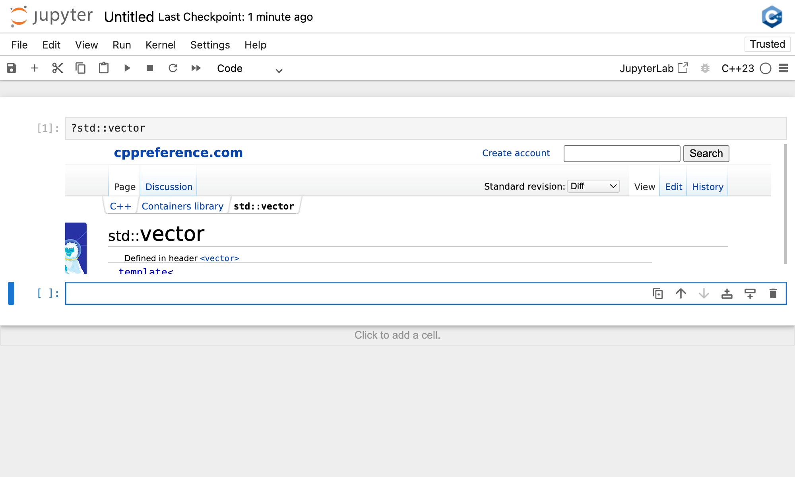

Inline documentation
--------------------

The standard library
====================

The ``xeus-cpp`` kernel allows users to access help on functions and classes
of the standard library.

In a code cell, typing ``?std::vector`` will simply display the help page on
vector from the cppreference_ website.

Enabling the quick-help feature for third-party libraries
=========================================================

The quick help feature can be enabled for other libraries. To do so, a doxygen
tag file for your library must be placed under the ``xeus-cpp`` "data"
directory of the installation prefix, namely

.. code::

   PREFIX/share/xeus-cpp/tagfiles

For ``xeus-cpp`` to be able to make use of that information, a JSON
configuration file must be placed under the ``xeus-cpp`` `configuration`
directory of the installation prefix, namely

.. code::

   PREFIX/etc/xeus-cpp/tags.d

.. note::

   For more information on how to generate tag files for a doxygen
   documentation, check the `relevant section`_ of the doxygen documentation.

The format for the JSON configuration file is the following

.. code:: json

   {
       "url": "Base URL for the documentation",
       "tagfile": "Name of the doxygen tagfile"
   }

For example the JSON configuration file for the documentation of the standard
library is

.. code:: json

    {
        "url": "https://en.cppreference.com/w/",
        "tagfile": "cppreference-doxygen-web.tag.xml"
    }

.. note::

   We recommend that you only use the ``https`` protocol for the URL. Indeed,
   when the notebook is served over ``https``, content from unsecure sources
   will not be rendered.

.. _cppreference: https://en.cppreference.com
.. _`relevant section`: https://www.doxygen.nl/manual/external.html
