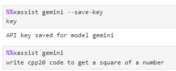
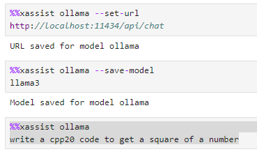
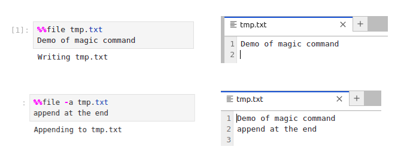

Magics commands
--------------------

Magics are special commands for the kernel that are not part of the C++
programming language.

There are defined with the symbol ``%`` for a line magic and ``%%`` for a cell
magic.

Here are the magics available in xeus-cpp.

%%xassist 
========================

Leverage the large language models to assist in your development process. Currently supported models are Gemini, OpenAI, Ollama. This magic command is supported in only xeus-cpp.

- Save the api key (for OpenAI and Gemini) 

.. code::

    %%xassist model --save-key
    key

- Save the model

- Set the response url (for Ollama)

.. code::

    %%xassist model --set-url
    key

.. code::

    %%xassist model --save-model
    key

- Use the model

.. code::

    %%xassist model
    prompt

- Reset model and clear chat history

.. code::

    %%xassist model --refresh
    

- Examples

%%file
========================

This magic command copies the content of the cell in a file named `filename`. This magic command is supported in both xeus-cpp and xeus-cpp-lite.

.. code::

    %%file [-a] filename

- Example

- Optional argument:

+------------+---------------------------------+
| -a         | append the content to the file. |
+------------+---------------------------------+