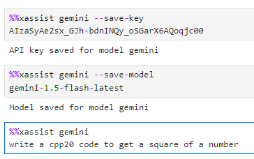

Magics commands
--------------------

Magics are special commands for the kernel that are not part of the C++
programming language.

There are defined with the symbol ``%`` for a line magic and ``%%`` for a cell
magic.

Here are the magics available in xeus-cpp.

%%xassist 
========================

Leverage the large language models to assist in your development process. Currently supported models are Gemini - gemini-1.5-flash, OpenAI - gpt-3.5-turbo-16k.

- Save the api key

.. code::

    %%xassist model --save-key
    key

- Use the model

.. code::

    %%xassist model
    prompt

- Reset model and clear chat history

.. code::

    %%xassist model --refresh

- Example

A new prompt is sent to the model everytime and the functionality to use previous context will be added soon.