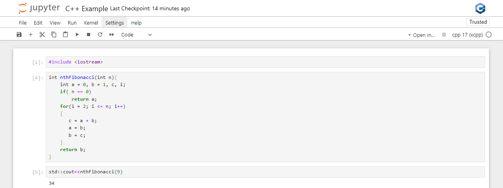

Tutorials
---------

This tutorial emphasises the abilities and usage of Xeus-cpp. Let's get
started! The tutorial demonstrates examples of C++
on Jupyter kernels.

1. Install the xeus-cpp from source using conda-forge for fetching dependencies.

2. Launch the Jupyter Notebook with either the C++17 or C++20 kernel available.

3. In a code cell, write the C++ code.

4. Run the code cell. The xeus-cpp kernel will compile and execute the code.
   The output would be displayed below the respective cell.

C++
===

In this example, you can modify the code and execute the cell again to see the
updated results. For example, you might change the values of `n`
(function arguments) of the function `nthFibonacci` to see expected output. You can try
out different examples to explore the features of C++.

The output of the cell will be displayed below once the code is executed and
xeus-cpp provides an interactive environment, where you can promptly make
the changes and prototype in C++.
